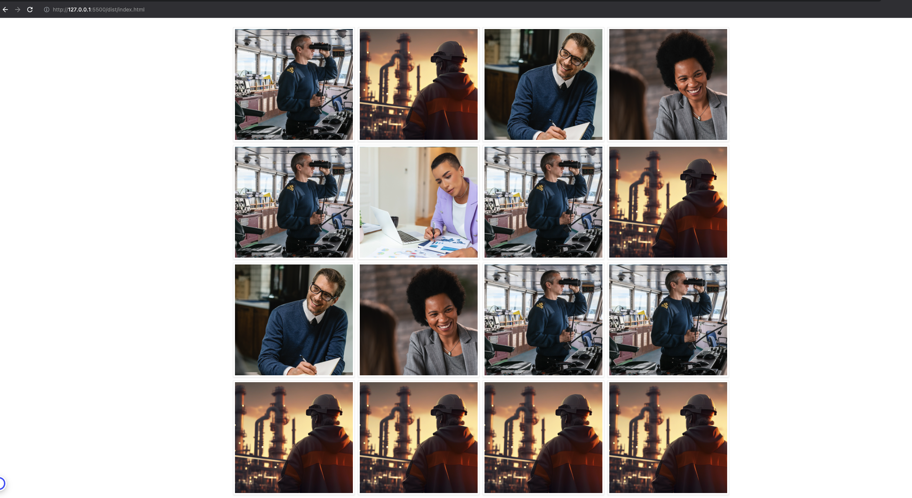

# Image Gallery Solution

1. Run `npm install` from the root.
2. Make sure you have Grunt and the Grunt CLI installed. Then run `grunt` to watch for changes and build the project.
3. I'm using VSCode for development and I have the Live Preview extension installed which serves the `dist/index.html` file on port 5500 (<http://127.0.0.1:5500/dist/index.html>).

## Notes
